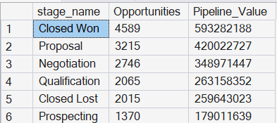
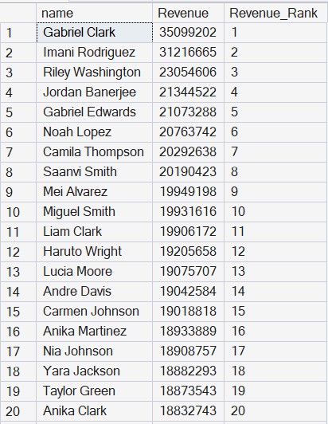
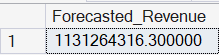
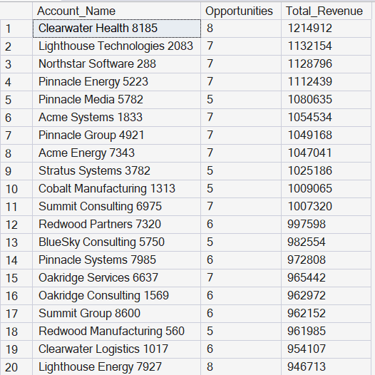

# CRM Sales Analytics using SQL Server

This project was created as part of my Business Analytics portfolio to demonstrate SQL skills by solving real-world CRM sales analysis problems.
##
### Business Objective

The objective of this project is to analyze CRM sales data using SQL Server and transform raw sales data into actionable business insights. The analysis focuses on lead generation, opportunity management, sales performance, pipeline health, revenue forecasting, and CRM data quality to support data-driven business decisions.

##
### Business Problem

Sales teams generate large volumes of CRM data every day, but raw data alone does not provide meaningful business insights.

The objective of this project is to use SQL to transform CRM data into actionable information that helps answer questions such as:

- Which lead sources generate the highest number of opportunities?
- What is our lead conversion rate?
- Which sales representatives contribute the highest pipeline revenue?
- Which opportunity stages contain the highest value?
- Which customer accounts generate the most revenue?
- How can data quality issues affect reporting?

##
### Dataset

The dataset consists of four related CRM tables representing leads, opportunities, customer accounts, and sales representatives.

| Table       | Description                               |
| ----------- | ----------------------------------------- |
| Lead        | Customer leads and conversion information |
| Opportunity | Sales opportunities and pipeline data     |
| Account     | Customer account details                  |
| Users       | Sales representative information          |

##
### Database Relationships

```
Users
  │
  ├── Lead (owner_id)
  │
  └── Opportunity (owner_id)
           │
           └── Account (account_id)
```
             
##
### Skills Demonstrated

#### SQL
- SELECT
- WHERE
- GROUP BY
- ORDER BY
- INNER JOIN
- Aggregate Functions
- CASE
- CAST
- Window Functions

#### Business Analysis
- Sales Analytics
- CRM Analytics
- KPI Reporting
- Pipeline Analysis
- Revenue Forecasting
- Data Quality Analysis

##
### Business Questions Answered

#### Lead Analysis
- Total Leads
- Lead Sources
- Lead Conversion Rate
- Lead Status Distribution
- Sales Representative Lead Ownership

#### Opportunity Analysis
- Total Opportunities
- Total Pipeline Revenue
- Average Deal Size
- Pipeline by Stage
-  Lead Source Performance
- Monthly Pipeline Trend
- Running Pipeline
- Forecasted Revenue

#### Sales Performance
- Revenue by Sales Representative
- Lead Conversion by Sales Representative
- Revenue by Department
- Revenue by Job Title
- Top Sales Representatives
- Sales Ranking using Window Functions

#### Customer Analysis
- Total Accounts
- Top Revenue Generating Accounts

#### Data Quality
- Missing Email Addresses
- Duplicate Companies

##
### SQL Concepts Used

- Data Aggregation
- Filtering and Sorting
- Table Joins
- Window Functions (RANK, Running Total)
- Date Functions
- Conditional Logic
- Data Type Conversion

##
### Key Business Insights

- Lead conversion analysis helped evaluate sales effectiveness.
- Sales pipeline analysis identified the opportunity stages contributing the highest potential revenue.
- Revenue forecasting was performed using opportunity probability.
- Sales representatives were ranked based on total pipeline value using SQL window functions.
- Customer account analysis identified the highest revenue-generating clients.
- CRM data quality checks highlighted duplicate companies and missing email records.

##
### 📊 Sample Analysis & Query Results

The following screenshots highlight some of the SQL analyses performed during this project.

#### 1. Lead Conversion Rate
This query calculates the total number of leads, converted leads, and the overall lead conversion rate.


---

#### 2. Pipeline Value by Opportunity Stage
This analysis identifies which sales stages contribute the highest potential revenue in the sales pipeline.



---

#### 3. Sales Representative Performance
Sales representatives are ranked based on the total value of opportunities they own using SQL aggregate and window functions.



---

#### 4. Revenue Forecast
Forecasted revenue is calculated by weighting each opportunity amount by its probability of closing.



---

#### 5. Top Revenue Generating Accounts
This analysis identifies customer accounts contributing the highest revenue.



##
### Technologies

- SQL Server Management Studio (SSMS)
- Microsoft SQL Server

##
## About Me

**Dinky Vadera**

Aspiring Business Analyst with 4+ years of experience in Sales Operations, CRM Analytics, and Business Development. Passionate about transforming business data into actionable insights using SQL, Python, Excel, and Power BI.

📧 Email: dinkyvadera1502@gmail.com

💼 LinkedIn: https://www.linkedin.com/in/dinkyvadera1502/

🌐 GitHub: https://github.com/dinkyvadera1502-code
